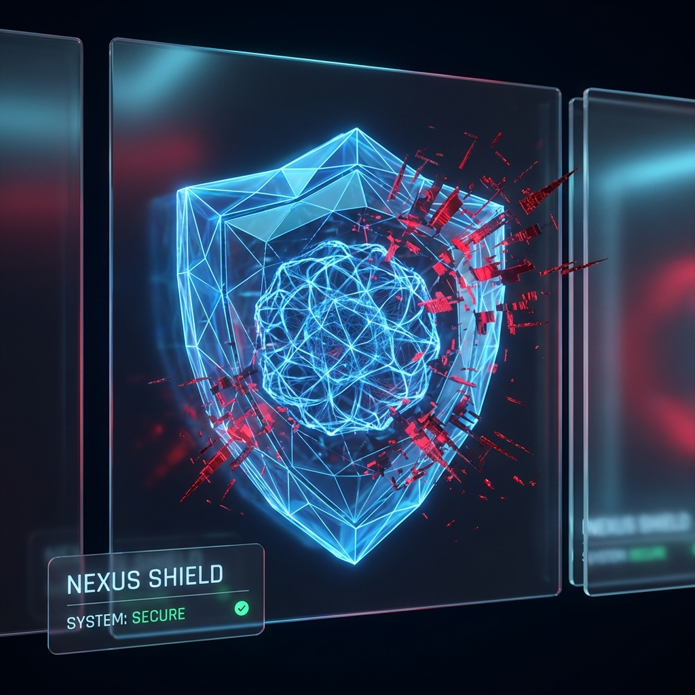
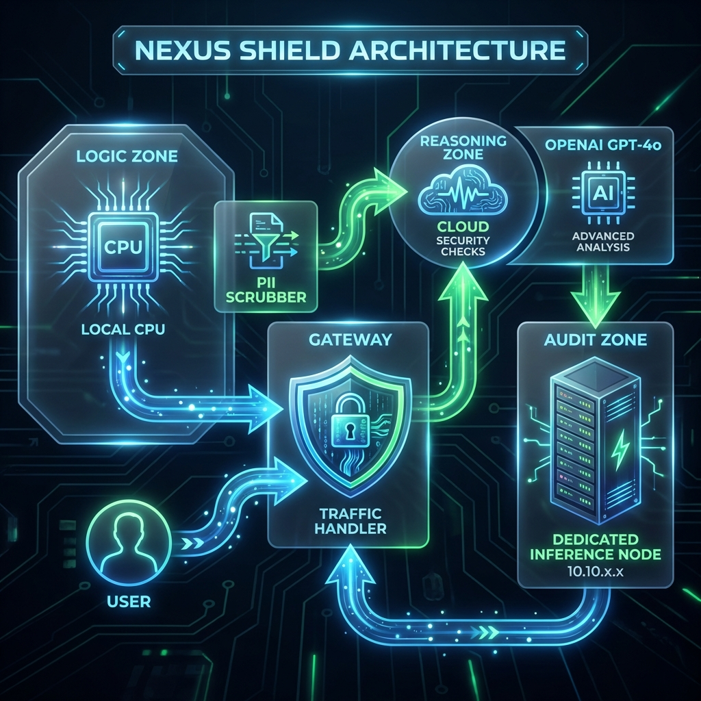

# Nexus Shield
### Hybrid AI Security Gateway & Governance Middleware




## Overview
A hybrid AI security gateway and governance middleware. Nexus Shield sits in front of
downstream AI services and **masks PII in real time** (via Presidio) before requests
reach the model — keeping sensitive data out of prompts while preserving utility.

## Quick Start
```bash
# 1. Clone
git clone https://github.com/Kimosabey/nexus-shield.git

# 2. Install
npm install

# 3. Run
npm run dev
```

## Key Features
- **PII masking** — detects and redacts sensitive entities before any model call (Presidio).
- **Governance middleware** — a NestJS gateway fronting downstream AI/LLM services.
- **Hybrid architecture** — local policy/redaction with cloud reasoning offload.
- **Hybrid compute** — application logic runs locally; heavy AI reasoning is offloaded to the cloud.

## Architecture



See [ARCHITECTURE.md](./docs/ARCHITECTURE.md) for the detailed design.

## Documentation
- [Architecture Guide](./docs/ARCHITECTURE.md)
- [Failure Scenarios](./docs/FAILURE_SCENARIOS.md)
- [Getting Started](./docs/GETTING_STARTED.md)
- [Interview Q&A](./docs/INTERVIEW_QA.md)

## Author

**Harshan Aiyappa**
Fullstack Software Engineer — AI & R&D
Voice AI · Distributed Systems · Infrastructure

[](https://kimo-nexus.vercel.app/)
[](https://github.com/Kimosabey)
[](https://linkedin.com/in/harshan-aiyappa)
[](https://x.com/HarshanAiyappa)
