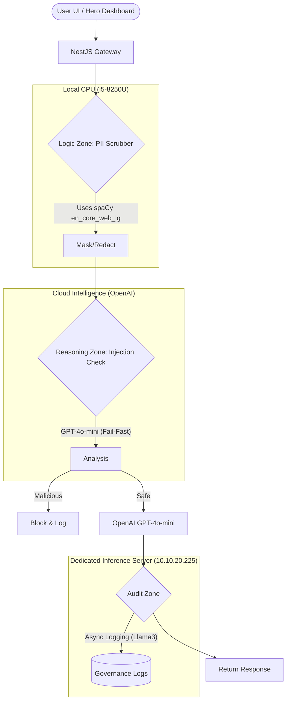

# Architecture: Nexus Shield (AG-06)

## Overview
Nexus Shield is an Antigravity-optimized intelligent proxy. It provides a multi-layered defense mechanism with a **Hybrid Compute Architecture** designed for low-latency security on constrained hardware.

## System Flow (HLD)




## Layer Definitions

### 1. Interception Layer (NestJS)
- **Port**: 3002
- Uses **Hero UI** dashboard for real-time telemetry.
- Orchestrates the "Logic vs. Reasoning" split to minimize latency.

### 2. Logic Zone (Local CPU - Privacy)
- **Engine**: FastAPI + Microsoft Presidio + `spaCy (en_core_web_lg)`.
- **Hardware Optimization**: Runs purely on local CPU/RAM (24GB). No GPU required.
- **Latency**: <100ms for entity extraction.

### 3. Reasoning Zone (Cloud - Security)
- **Engine**: OpenAI GPT-4o-mini.
- **Strategy**: **Fail-Fast**. We offload "Jailbreak Detection" to the cloud because running a 7B+ parameter model locally for *blocking* introduces unacceptable latency (5s+). Cloud checks take ~400ms.

### 4. Audit Zone (Dedicated Server - Governance)
- **Engine**: Ollama (Llama3) running on `10.10.20.225`.
- **Behavior**: Asynchronous. User does not wait for this. The system logs and scores the interaction in the background.

## Tech Specs
- **Gateway**: NestJS (v10) + Circuit Breaker
- **PII Service**: Python 3.11 + Presidio + spaCy
- **Injection Model**: GPT-4o-mini (Cloud)
- **Audit Model**: Llama3 (Dedicated Server)
- **Frontend**: Next.js 15 + Hero UI + Framer Motion
```
